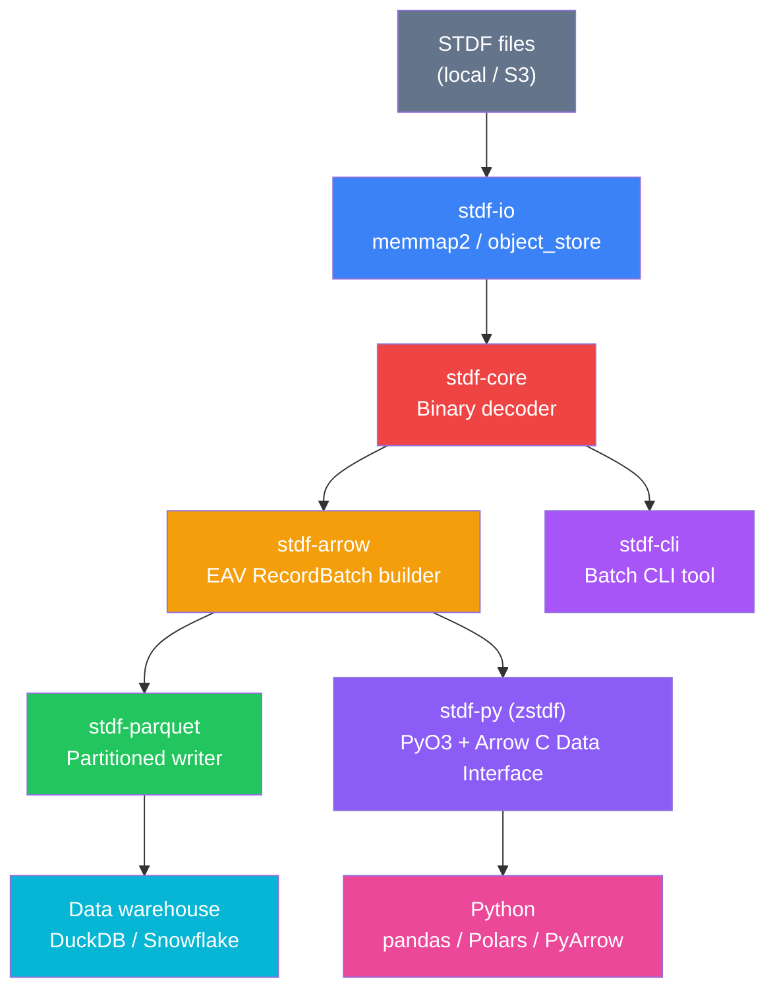

# zstdf — Implementation Plan

> Following [STDF_RS_SPEC.md](file:///c:/Users/zzhou/Documents/CS224R/proj/zstdf/STDF_RS_SPEC.md)

## Overview

Build a **6-crate Cargo workspace** that decodes STDF V4 binary semiconductor test data at GB-to-TB scale, converts to columnar Arrow/Parquet, and exposes a Python package (`zstdf`) via PyO3 with zero-copy Arrow interop.



---

## Decisions (Resolved)

| Question | Decision |
|:---------|:---------|
| Project location | `proj/zstdf/` (standalone) |
| Python package name | `zstdf` |
| STDF version | Strict V4 baseline, auto-detect V4-2007 via VUR |
| ATE compatibility | Teradyne + Advantest (endianness + vendor quirks) |
| Output format | EAV long-format Arrow RecordBatches (primary) |
| Parquet partitioning | `lot_id / wafer_id / test_date` |
| Python→Rust interop | Arrow C Data Interface (zero-copy) |
| Non-core records | `Record::Unknown { typ, sub, data }` — preserve raw bytes, never fail |
| Truncated files | Graceful degradation — return valid records up to failure |
| STDF writing | Out of scope for v0.1 |

---

## Crate Architecture

| Crate | Responsibility | Dependencies |
|:------|:--------------|:-------------|
| `stdf-core` | Pure binary decode, no I/O assumptions | `thiserror` |
| `stdf-io` | File reading (local `memmap2`, remote `object_store`), record-boundary pre-scan | `stdf-core`, `memmap2`, `object_store` |
| `stdf-arrow` | Build typed Arrow `RecordBatch`es from decoded records | `stdf-core`, `arrow` |
| `stdf-parquet` | Partitioned Parquet writing | `stdf-arrow`, `parquet` |
| `stdf-py` | PyO3 bindings, `zstdf` Python module | all above, `pyo3`, `arrow-pyarrow` |
| `stdf-cli` | Command-line batch conversion tool | all above, `clap` |

### Directory Layout

```
zstdf/
├── Cargo.toml                     # Workspace root
├── STDF_RS_SPEC.md                # Existing spec
├── README.md
├── LICENSE
│
├── stdf-core/
│   ├── Cargo.toml
│   └── src/
│       ├── lib.rs                 # Public API + re-exports
│       ├── types.rs               # ByteOrder, RecordType, VarData
│       ├── error.rs               # StdfError (thiserror)
│       ├── header.rs              # RecordHeader (4-byte framing)
│       ├── fields.rs              # FieldReader (binary field decoder)
│       └── records/
│           ├── mod.rs             # StdfRecord enum + dispatch
│           ├── far.rs             # (0,10) File Attributes
│           ├── atr.rs             # (0,20) Audit Trail
│           ├── mir.rs             # (1,10) Master Information
│           ├── mrr.rs             # (1,20) Master Results
│           ├── pcr.rs             # (1,30) Part Count
│           ├── hbr.rs             # (1,40) Hardware Bin
│           ├── sbr.rs             # (1,50) Software Bin
│           ├── pmr.rs             # (1,60) Pin Map
│           ├── pgr.rs             # (1,62) Pin Group
│           ├── plr.rs             # (1,63) Pin List
│           ├── rdr.rs             # (1,70) Retest Data
│           ├── sdr.rs             # (1,80) Site Description
│           ├── wir.rs             # (2,10) Wafer Information
│           ├── wrr.rs             # (2,20) Wafer Results
│           ├── wcr.rs             # (2,30) Wafer Configuration
│           ├── pir.rs             # (5,10) Part Information
│           ├── prr.rs             # (5,20) Part Results
│           ├── tsr.rs             # (10,30) Test Synopsis
│           ├── ptr.rs             # (15,10) Parametric Test
│           ├── mpr.rs             # (15,15) Multi-Result Parametric
│           ├── ftr.rs             # (15,20) Functional Test
│           ├── bps.rs             # (20,10) Begin Program Section
│           ├── eps.rs             # (20,20) End Program Section
│           ├── gdr.rs             # (50,10) Generic Data
│           └── dtr.rs             # (50,30) Datalog Text
│
├── stdf-io/
│   ├── Cargo.toml
│   └── src/
│       ├── lib.rs
│       ├── local.rs               # memmap2 local file reader
│       ├── streaming.rs           # BufReader-based streaming
│       └── prescan.rs             # Record-boundary pre-scan for parallel decode
│
├── stdf-arrow/
│   ├── Cargo.toml
│   └── src/
│       ├── lib.rs
│       ├── schema.rs              # EAV Arrow schema definition
│       ├── batch_builder.rs       # RecordBatch builder from decoded records
│       └── context.rs             # Lot/wafer context tracking (MIR→PIR→PTR→PRR)
│
├── stdf-parquet/
│   ├── Cargo.toml
│   └── src/
│       ├── lib.rs
│       └── writer.rs              # Partitioned Parquet writer
│
├── stdf-py/
│   ├── Cargo.toml
│   ├── pyproject.toml
│   └── src/
│       └── lib.rs                 # #[pymodule] zstdf
│
├── zstdf/                         # Python package (mixed layout)
│   ├── __init__.py
│   └── py.typed                   # PEP 561 marker
│
├── stdf-cli/
│   ├── Cargo.toml
│   └── src/
│       └── main.rs
│
├── tests/                         # Python integration tests
│   ├── conftest.py
│   ├── test_read.py
│   ├── test_iter.py
│   └── test_parquet.py
│
└── benches/
    └── decode_bench.rs
```

---

## STDF V4 Complete Record Reference

### Record Header (4 bytes, every record)

| Offset | Size | Field | Type | Description |
|:-------|:-----|:------|:-----|:------------|
| 0 | 2 | `REC_LEN` | U\*2 | Data payload length (excludes this 4-byte header) |
| 2 | 1 | `REC_TYP` | U\*1 | Record type code |
| 3 | 1 | `REC_SUB` | U\*1 | Record subtype code |

**Endianness**: determined by FAR's `CPU_TYPE` field (first record):
- `0` = DEC PDP-11/VAX (legacy, mixed-endian)
- `1` = Sun/SPARC → **big-endian**
- `2` = IBM PC/x86 → **little-endian** (most common today)

> [!IMPORTANT]
> **Teradyne** typically writes CPU_TYPE=2 (little-endian). **Advantest** may write CPU_TYPE=1 (big-endian) or CPU_TYPE=2 depending on platform. The parser must handle both seamlessly based on FAR detection.

### STDF Data Types → Rust Mapping

| STDF | Description | Rust | Read Logic |
|:-----|:------------|:-----|:-----------|
| U\*1 | Unsigned 1B int | `u8` | 1 byte direct |
| U\*2 | Unsigned 2B int | `u16` | 2 bytes, endian-aware |
| U\*4 | Unsigned 4B int | `u32` | 4 bytes, endian-aware |
| I\*1 | Signed 1B int | `i8` | 1 byte direct |
| I\*2 | Signed 2B int | `i16` | 2 bytes, endian-aware |
| I\*4 | Signed 4B int | `i32` | 4 bytes, endian-aware |
| R\*4 | IEEE 754 float | `f32` | 4 bytes, endian-aware |
| R\*8 | IEEE 754 double | `f64` | 8 bytes, endian-aware |
| C\*1 | Fixed char | `u8` | 1 byte |
| C\*n | Variable string | `String` | 1st byte = len, then ASCII |
| C\*f | Fixed string | `String` | Fixed-length |
| B\*1 | Bit flags (1B) | `u8` | 1 byte |
| B\*n | Variable binary | `Vec<u8>` | 1st byte = byte count |
| D\*n | Bit array | `(u16, Vec<u8>)` | 1st 2B = bit count, then ⌈bits/8⌉ bytes |
| N\*1 | Nibble (4 bits) | `u8` | Packed 2 per byte, LSN first |
| V\*n | GDR variable | `VarData` enum | Type byte + value |

V\*n type codes: 0=pad, 1=U\*1, 2=U\*2, 3=U\*4, 4=I\*1, 5=I\*2, 6=I\*4, 7=R\*4, 8=R\*8, 10=C\*n, 11=B\*n, 12=D\*n, 13=N\*1

### All 25 Record Types

| Record | (TYP,SUB) | Full Name | Phase 1? |
|:-------|:----------|:----------|:---------|
| FAR | (0,10) | File Attributes | ✅ |
| ATR | (0,20) | Audit Trail | ✅ |
| MIR | (1,10) | Master Information | ✅ |
| MRR | (1,20) | Master Results | ✅ |
| PCR | (1,30) | Part Count | ✅ |
| HBR | (1,40) | Hardware Bin | ✅ |
| SBR | (1,50) | Software Bin | ✅ |
| PMR | (1,60) | Pin Map | ✅ |
| PGR | (1,62) | Pin Group | defer |
| PLR | (1,63) | Pin List | defer |
| RDR | (1,70) | Retest Data | defer |
| SDR | (1,80) | Site Description | defer |
| WIR | (2,10) | Wafer Information | ✅ |
| WRR | (2,20) | Wafer Results | ✅ |
| WCR | (2,30) | Wafer Configuration | defer |
| PIR | (5,10) | Part Information | ✅ |
| PRR | (5,20) | Part Results | ✅ |
| TSR | (10,30) | Test Synopsis | ✅ |
| PTR | (15,10) | Parametric Test | ✅ |
| MPR | (15,15) | Multi-Result Parametric | ✅ |
| FTR | (15,20) | Functional Test | ✅ |
| BPS | (20,10) | Begin Program Section | defer |
| EPS | (20,20) | End Program Section | defer |
| GDR | (50,10) | Generic Data | ✅ |
| DTR | (50,30) | Datalog Text | ✅ |

> [!NOTE]
> Deferred records decode as `StdfRecord::Unknown { typ, sub, data }` — raw payload preserved, never dropped.

---

### Key Record Field Specifications

<details>
<summary><b>FAR (0,10) — File Attributes Record</b></summary>

| Field | Type | Mandatory | Description |
|:------|:-----|:----------|:------------|
| CPU_TYPE | U\*1 | ✅ | Endianness: 0=VAX, 1=Sun(BE), 2=x86(LE) |
| STDF_VER | U\*1 | ✅ | STDF version (must be 4) |

</details>

<details>
<summary><b>MIR (1,10) — Master Information Record (~38 fields)</b></summary>

| Field | Type | Mandatory | Description |
|:------|:-----|:----------|:------------|
| SETUP_T | U\*4 | ✅ | Job setup timestamp |
| START_T | U\*4 | ✅ | First part test timestamp |
| STAT_NUM | U\*1 | ✅ | Tester station number |
| MODE_COD | C\*1 | ✅ | Test mode (P=prod, D=dev, E=eng, M=maint) |
| RTST_COD | C\*1 | ✅ | Retest code |
| PROT_COD | C\*1 | ✅ | Protection code |
| BURN_TIM | U\*2 | ✅ | Burn-in time |
| CMOD_COD | C\*1 | ✅ | Command mode code |
| LOT_ID | C\*n | ✅ | Lot identifier |
| PART_TYP | C\*n | ✅ | Part type/product name |
| NODE_NAM | C\*n | ✅ | Tester node name |
| TSTR_TYP | C\*n | ✅ | Tester type |
| JOB_NAM | C\*n | ✅ | Test program name |
| JOB_REV | C\*n | opt | Job revision |
| SBLOT_ID | C\*n | opt | Sublot ID |
| OPER_NAM | C\*n | opt | Operator name |
| EXEC_TYP | C\*n | opt | Exec SW type |
| EXEC_VER | C\*n | opt | Exec SW version |
| TEST_COD | C\*n | opt | Test phase code |
| TST_TEMP | C\*n | opt | Test temperature |
| USER_TXT | C\*n | opt | User text |
| AUX_FILE | C\*n | opt | Auxiliary filename |
| PKG_TYP | C\*n | opt | Package type |
| FAMLY_ID | C\*n | opt | Product family ID |
| DATE_COD | C\*n | opt | Date code |
| FACIL_ID | C\*n | opt | Facility ID |
| FLOOR_ID | C\*n | opt | Floor ID |
| PROC_ID | C\*n | opt | Process ID |
| OPER_FRQ | C\*n | opt | Operation frequency |
| SPEC_NAM | C\*n | opt | Spec name |
| SPEC_VER | C\*n | opt | Spec version |
| FLOW_ID | C\*n | opt | Test flow ID |
| SETUP_ID | C\*n | opt | Setup ID |
| DSGN_REV | C\*n | opt | Design revision |
| ENG_ID | C\*n | opt | Engineering lot ID |
| ROM_COD | C\*n | opt | ROM code |
| SERL_NUM | C\*n | opt | Tester serial number |
| SUPR_NAM | C\*n | opt | Supervisor name |

</details>

<details>
<summary><b>PTR (15,10) — Parametric Test Record ⭐ highest value</b></summary>

| Field | Type | Mandatory | Description |
|:------|:-----|:----------|:------------|
| TEST_NUM | U\*4 | ✅ | Test number |
| HEAD_NUM | U\*1 | ✅ | Test head |
| SITE_NUM | U\*1 | ✅ | Test site |
| TEST_FLG | B\*1 | ✅ | Bit 0: alarm, bit 6: pass/fail valid, bit 7: 0=pass 1=fail |
| PARM_FLG | B\*1 | ✅ | Bit 0: scale/drift, bit 1: no lo limit, bit 2: no hi limit, etc. |
| RESULT | R\*4 | ✅ | Test result value |
| TEST_TXT | C\*n | opt | Test name/description |
| ALARM_ID | C\*n | opt | Alarm ID |
| OPT_FLAG | B\*1 | opt | Controls which optional fields are valid |
| RES_SCAL | I\*1 | opt | Result scaling exponent (10^n) |
| LLM_SCAL | I\*1 | opt | Low limit scaling exponent |
| HLM_SCAL | I\*1 | opt | High limit scaling exponent |
| LO_LIMIT | R\*4 | opt | Low test limit |
| HI_LIMIT | R\*4 | opt | High test limit |
| UNITS | C\*n | opt | Test units (V, A, Ohm, Hz, etc.) |
| C_RESFMT | C\*n | opt | Result format string |
| C_LLMFMT | C\*n | opt | Low limit format string |
| C_HLMFMT | C\*n | opt | High limit format string |
| LO_SPEC | R\*4 | opt | Low spec limit |
| HI_SPEC | R\*4 | opt | High spec limit |

</details>

<details>
<summary><b>MPR (15,15) — Multiple-Result Parametric Record</b></summary>

| Field | Type | Mandatory | Description |
|:------|:-----|:----------|:------------|
| TEST_NUM | U\*4 | ✅ | Test number |
| HEAD_NUM | U\*1 | ✅ | Head |
| SITE_NUM | U\*1 | ✅ | Site |
| TEST_FLG | B\*1 | ✅ | Test flags |
| PARM_FLG | B\*1 | ✅ | Parametric flags |
| RTN_ICNT | U\*2 | ✅ | Count of return index/state values |
| RSLT_CNT | U\*2 | ✅ | Count of result values |
| RTN_STAT | N\*1 array | opt | Return states (4 bits packed, count=RTN_ICNT) |
| RTN_RSLT | R\*4 array | opt | Result values (count=RSLT_CNT) |
| TEST_TXT | C\*n | opt | Test name |
| ALARM_ID | C\*n | opt | Alarm ID |
| OPT_FLAG | B\*1 | opt | Optional flags |
| RES_SCAL | I\*1 | opt | Result scaling |
| LLM_SCAL | I\*1 | opt | Low limit scaling |
| HLM_SCAL | I\*1 | opt | High limit scaling |
| LO_LIMIT | R\*4 | opt | Low limit |
| HI_LIMIT | R\*4 | opt | High limit |
| START_IN | R\*4 | opt | Starting input |
| INCR_IN | R\*4 | opt | Input increment |
| RTN_INDX | U\*2 array | opt | PMR indexes (count=RTN_ICNT) |
| UNITS | C\*n | opt | Units |
| UNITS_IN | C\*n | opt | Input units |
| C_RESFMT | C\*n | opt | Result format |
| C_LLMFMT | C\*n | opt | Low limit format |
| C_HLMFMT | C\*n | opt | High limit format |
| LO_SPEC | R\*4 | opt | Low spec |
| HI_SPEC | R\*4 | opt | High spec |

</details>

<details>
<summary><b>FTR (15,20) — Functional Test Record</b></summary>

| Field | Type | Mandatory | Description |
|:------|:-----|:----------|:------------|
| TEST_NUM | U\*4 | ✅ | Test number |
| HEAD_NUM | U\*1 | ✅ | Head |
| SITE_NUM | U\*1 | ✅ | Site |
| TEST_FLG | B\*1 | ✅ | Test flags |
| OPT_FLAG | B\*1 | opt | Optional data flags |
| CYCL_CNT | U\*4 | opt | Cycle count |
| REL_VADR | U\*4 | opt | Relative vector address |
| REPT_CNT | U\*4 | opt | Repeat count |
| NUM_FAIL | U\*4 | opt | Number failing pins |
| XFAIL_AD | I\*4 | opt | X fail address |
| YFAIL_AD | I\*4 | opt | Y fail address |
| VECT_OFF | I\*2 | opt | Vector offset |
| RTN_ICNT | U\*2 | opt | Return index count |
| PGM_ICNT | U\*2 | opt | Program index count |
| RTN_INDX | U\*2 array | opt | Return PMR indexes |
| RTN_STAT | N\*1 array | opt | Return states (nibble-packed) |
| PGM_INDX | U\*2 array | opt | Program PMR indexes |
| PGM_STAT | N\*1 array | opt | Program states (nibble-packed) |
| FAIL_PIN | D\*n | opt | Failing pin bitfield |
| VECT_NAM | C\*n | opt | Vector name |
| TIME_SET | C\*n | opt | Time set name |
| OP_CODE | C\*n | opt | Op code |
| TEST_TXT | C\*n | opt | Test text |
| ALARM_ID | C\*n | opt | Alarm ID |
| PROG_TXT | C\*n | opt | Program text |
| RSLT_TXT | C\*n | opt | Result text |
| PATG_NUM | U\*1 | opt | Pattern generator number |
| SPIN_MAP | D\*n | opt | Comparator bitmap |

</details>

<details>
<summary><b>PRR (5,20) — Part Results Record</b></summary>

| Field | Type | Mandatory | Description |
|:------|:-----|:----------|:------------|
| HEAD_NUM | U\*1 | ✅ | Head |
| SITE_NUM | U\*1 | ✅ | Site |
| PART_FLG | B\*1 | ✅ | Part flags (bit 4: no pass/fail, bit 3: 0=fresh 1=retest) |
| NUM_TEST | U\*2 | ✅ | Tests executed |
| HARD_BIN | U\*2 | ✅ | Hardware bin |
| SOFT_BIN | U\*2 | ✅ | Software bin |
| X_COORD | I\*2 | opt | Die X (-32768 = missing) |
| Y_COORD | I\*2 | opt | Die Y (-32768 = missing) |
| TEST_T | U\*4 | opt | Test time (ms) |
| PART_ID | C\*n | opt | Part ID |
| PART_TXT | C\*n | opt | Description |
| PART_FIX | B\*n | opt | Repair info |

</details>

<details>
<summary><b>Other Records (PIR, MRR, PCR, HBR, SBR, PMR, WIR, WRR, TSR, GDR, DTR, ATR)</b></summary>

**PIR (5,10)**: HEAD_NUM U\*1, SITE_NUM U\*1

**MRR (1,20)**: FINISH_T U\*4, DISP_COD C\*1 (opt), USR_DESC C\*n (opt), EXC_DESC C\*n (opt)

**PCR (1,30)**: HEAD_NUM U\*1, SITE_NUM U\*1, PART_CNT U\*4, RTST_CNT U\*4 (opt), ABRT_CNT U\*4 (opt), GOOD_CNT U\*4 (opt), FUNC_CNT U\*4 (opt)

**HBR (1,40)**: HEAD_NUM U\*1, SITE_NUM U\*1, HBIN_NUM U\*2, HBIN_CNT U\*4, HBIN_PF C\*1 (opt), HBIN_NAM C\*n (opt)

**SBR (1,50)**: Same pattern as HBR (SBIN_NUM, SBIN_CNT, SBIN_PF, SBIN_NAM)

**PMR (1,60)**: PMR_INDX U\*2, CHAN_TYP U\*2 (opt), CHAN_NAM C\*n (opt), PHY_NAM C\*n (opt), LOG_NAM C\*n (opt), HEAD_NUM U\*1 (opt), SITE_NUM U\*1 (opt)

**WIR (2,10)**: HEAD_NUM U\*1, SITE_GRP U\*1 (opt), START_T U\*4 (opt), WAFER_ID C\*n (opt)

**WRR (2,20)**: HEAD_NUM U\*1, SITE_GRP U\*1 (opt), FINISH_T U\*4, PART_CNT U\*4, RTST_CNT U\*4 (opt), ABRT_CNT U\*4 (opt), GOOD_CNT U\*4 (opt), FUNC_CNT U\*4 (opt), WAFER_ID C\*n (opt), FABWF_ID C\*n (opt), FRAME_ID C\*n (opt), MASK_ID C\*n (opt), USR_DESC C\*n (opt), EXC_DESC C\*n (opt)

**TSR (10,30)**: HEAD_NUM U\*1, SITE_NUM U\*1, TEST_TYP C\*1, TEST_NUM U\*4, EXEC_CNT U\*4 (opt), FAIL_CNT U\*4 (opt), ALRM_CNT U\*4 (opt), TEST_NAM C\*n (opt), SEQ_NAME C\*n (opt), TEST_LBL C\*n (opt), OPT_FLAG B\*1 (opt), TEST_TIM R\*4 (opt), TEST_MIN R\*4 (opt), TEST_MAX R\*4 (opt), TST_SUMS R\*4 (opt), TST_SQRS R\*4 (opt)

**GDR (50,10)**: FLD_CNT U\*2, GEN_DATA V\*n array (FLD_CNT elements)

**DTR (50,30)**: TEXT_DAT C\*n

**ATR (0,20)**: MOD_TIM U\*4, CMD_LINE C\*n

</details>

---

## EAV Long-Format Arrow Schema

The primary output shape — one row per test measurement:

```
part_id:     Utf8           # from PRR.PART_ID or synthesized "HEAD-SITE-SEQ"
lot_id:      Utf8           # from MIR.LOT_ID
wafer_id:    Utf8 (nullable)# from WIR.WAFER_ID
head_num:    UInt8
site_num:    UInt8
test_num:    UInt32
test_txt:    Utf8 (nullable)# from PTR/MPR/FTR.TEST_TXT
test_type:   Utf8           # "PTR" | "MPR" | "FTR"
result:      Float32 (nullable) # PTR.RESULT, or NULL for FTR
pass_fail:   Boolean        # derived from TEST_FLG bit 7
hard_bin:    UInt16         # from PRR.HARD_BIN
soft_bin:    UInt16         # from PRR.SOFT_BIN
x_coord:     Int16 (nullable)
y_coord:     Int16 (nullable)
lo_limit:    Float32 (nullable)
hi_limit:    Float32 (nullable)
units:       Utf8 (nullable)
test_time_ms:UInt32 (nullable)# from PRR.TEST_T
```

> [!TIP]
> This schema uses memory-efficient Arrow types matching STDF's native sizes (UInt8, UInt16, Float32) rather than promoting everything to Float64.

---

## Phased Implementation with AI Prompts

Below are **7 self-contained prompts** — one per phase from the spec. Each is designed so an AI coding agent can execute it independently given the prior phases' output.

---

### Phase 0: Project Setup & Workspace Scaffold

> [!NOTE]
> This phase creates the Cargo workspace, all 6 crate skeletons, `pyproject.toml`, and verifies compilation.

````markdown
# Prompt: Phase 0 — zstdf Workspace Scaffold

You are setting up a new Rust project called `zstdf` — a high-performance STDF V4 semiconductor test data parser. Create the full Cargo workspace structure at the project root.

## Project Root
The project already exists at the current directory with only `STDF_RS_SPEC.md`. Create everything else.

## Create `Cargo.toml` (workspace root)
```toml
[workspace]
members = [
    "stdf-core",
    "stdf-io",
    "stdf-arrow",
    "stdf-parquet",
    "stdf-py",
    "stdf-cli",
]
resolver = "2"

[workspace.package]
version = "0.1.0"
edition = "2021"
license = "MIT"

[workspace.dependencies]
thiserror = "2"
arrow = { version = "55", features = ["pyarrow"] }
parquet = { version = "55", features = ["arrow"] }
pyo3 = { version = "0.23", features = ["extension-module"] }
memmap2 = "0.9"
clap = { version = "4", features = ["derive"] }
serde = { version = "1", features = ["derive"] }
rayon = "1.10"
flate2 = "1"
```

## Create 6 crate skeletons

### `stdf-core/Cargo.toml`
```toml
[package]
name = "stdf-core"
version.workspace = true
edition.workspace = true

[lib]
crate-type = ["rlib"]

[dependencies]
thiserror.workspace = true

[dev-dependencies]
# none yet
```
- Create `stdf-core/src/lib.rs` with placeholder: `pub mod types; pub mod error; pub mod header; pub mod fields; pub mod records;`
- Create empty module files: `types.rs`, `error.rs`, `header.rs`, `fields.rs`, `records/mod.rs`

### `stdf-io/Cargo.toml`
```toml
[package]
name = "stdf-io"
version.workspace = true
edition.workspace = true

[dependencies]
stdf-core = { path = "../stdf-core" }
memmap2.workspace = true
thiserror.workspace = true
flate2.workspace = true
```
- Create `stdf-io/src/lib.rs` with placeholder

### `stdf-arrow/Cargo.toml`
```toml
[package]
name = "stdf-arrow"
version.workspace = true
edition.workspace = true

[dependencies]
stdf-core = { path = "../stdf-core" }
arrow.workspace = true
thiserror.workspace = true
```
- Create `stdf-arrow/src/lib.rs` with placeholder

### `stdf-parquet/Cargo.toml`
```toml
[package]
name = "stdf-parquet"
version.workspace = true
edition.workspace = true

[dependencies]
stdf-core = { path = "../stdf-core" }
stdf-arrow = { path = "../stdf-arrow" }
parquet.workspace = true
arrow.workspace = true
thiserror.workspace = true
```
- Create `stdf-parquet/src/lib.rs` with placeholder

### `stdf-py/Cargo.toml`
```toml
[package]
name = "stdf-py"
version.workspace = true
edition.workspace = true

[lib]
name = "zstdf"
crate-type = ["cdylib", "rlib"]

[dependencies]
stdf-core = { path = "../stdf-core" }
stdf-io = { path = "../stdf-io" }
stdf-arrow = { path = "../stdf-arrow" }
stdf-parquet = { path = "../stdf-parquet" }
pyo3.workspace = true
arrow.workspace = true
```
- Create `stdf-py/src/lib.rs`:
```rust
use pyo3::prelude::*;

#[pymodule]
fn zstdf(m: &Bound<'_, PyModule>) -> PyResult<()> {
    m.add("__version__", "0.1.0")?;
    Ok(())
}
```
- Create `stdf-py/pyproject.toml`:
```toml
[build-system]
requires = ["maturin>=1.0,<2.0"]
build-backend = "maturin"

[project]
name = "zstdf"
version = "0.1.0"
description = "High-performance STDF V4 parser — Rust core with Python bindings"
requires-python = ">=3.9"
license = { text = "MIT" }
classifiers = [
    "Programming Language :: Python :: 3",
    "Programming Language :: Rust",
    "Topic :: Scientific/Engineering :: Electronic Design Automation (EDA)",
]
dependencies = ["pyarrow>=14.0"]

[project.optional-dependencies]
dev = ["pytest", "maturin", "polars", "pandas"]

[tool.maturin]
manifest-path = "Cargo.toml"
features = ["pyo3/extension-module"]
python-source = ".."
module-name = "zstdf._zstdf"
```

### `stdf-cli/Cargo.toml`
```toml
[package]
name = "stdf-cli"
version.workspace = true
edition.workspace = true

[[bin]]
name = "zstdf"
path = "src/main.rs"

[dependencies]
stdf-core = { path = "../stdf-core" }
stdf-io = { path = "../stdf-io" }
stdf-arrow = { path = "../stdf-arrow" }
stdf-parquet = { path = "../stdf-parquet" }
clap.workspace = true
```
- Create `stdf-cli/src/main.rs` with placeholder `fn main() {}`

### Python package
- Create `zstdf/__init__.py`:
```python
"""zstdf — High-performance STDF V4 parser."""
__version__ = "0.1.0"
```
- Create `zstdf/py.typed` (empty PEP 561 marker)

## Verify
Run: `cargo check --workspace`
All crates must compile (even if they're mostly stubs). Fix any dependency resolution issues.
````

---

### Phase 1: Core Decode (`stdf-core`)

````markdown
# Prompt: Phase 1 — stdf-core Binary Decoder

You are implementing Phase 1 of `zstdf`. The workspace scaffold from Phase 0 exists. Now implement the complete STDF V4 binary decoder in `stdf-core/`.

## Design Principles
1. **No I/O** — `stdf-core` works on `&[u8]` slices, not files. I/O is `stdf-io`'s job.
2. **Graceful degradation** — truncated records return `StdfError::UnexpectedEof`, but the parser continues. Never panic.
3. **Preserve unknown records** — `StdfRecord::Unknown { typ, sub, data: Vec<u8> }` for any unrecognized (typ, sub).
4. **Optional trailing fields** — STDF allows omitting trailing optional fields. Check `reader.remaining()` before each optional field; set to `None` if absent.
5. **No unsafe** in the decode path.

## Files to implement

### `stdf-core/src/error.rs`
```rust
use thiserror::Error;

#[derive(Error, Debug)]
pub enum StdfError {
    #[error("unexpected EOF at byte {position}: needed {expected} more bytes")]
    UnexpectedEof { position: usize, expected: usize },

    #[error("invalid FAR: expected (typ=0, sub=10), got ({typ}, {sub})")]
    InvalidFar { typ: u8, sub: u8 },

    #[error("unsupported STDF version {0} (only V4 supported)")]
    UnsupportedVersion(u8),

    #[error("invalid field in {record}.{field}: {msg}")]
    InvalidField { record: &'static str, field: &'static str, msg: String },

    #[error("I/O error: {0}")]
    Io(#[from] std::io::Error),
}

pub type Result<T> = std::result::Result<T, StdfError>;
```

### `stdf-core/src/types.rs`
```rust
/// Byte order detected from FAR.CPU_TYPE
#[derive(Debug, Clone, Copy, PartialEq, Eq)]
pub enum ByteOrder {
    LittleEndian,  // CPU_TYPE = 2 (x86, most common)
    BigEndian,     // CPU_TYPE = 1 (Sun/SPARC, some Advantest)
}

/// Record type enumeration — maps (typ, sub) pairs to symbolic names
#[derive(Debug, Clone, Copy, PartialEq, Eq, Hash)]
pub enum RecordType {
    Far, Atr, Mir, Mrr, Pcr, Hbr, Sbr, Pmr, Pgr, Plr,
    Rdr, Sdr, Wir, Wrr, Wcr, Pir, Prr, Tsr, Ptr, Mpr,
    Ftr, Bps, Eps, Gdr, Dtr,
    Unknown(u8, u8),
}

impl RecordType {
    pub fn from_type_sub(typ: u8, sub: u8) -> Self {
        match (typ, sub) {
            (0, 10) => Self::Far, (0, 20) => Self::Atr,
            (1, 10) => Self::Mir, (1, 20) => Self::Mrr,
            (1, 30) => Self::Pcr, (1, 40) => Self::Hbr,
            (1, 50) => Self::Sbr, (1, 60) => Self::Pmr,
            (1, 62) => Self::Pgr, (1, 63) => Self::Plr,
            (1, 70) => Self::Rdr, (1, 80) => Self::Sdr,
            (2, 10) => Self::Wir, (2, 20) => Self::Wrr,
            (2, 30) => Self::Wcr,
            (5, 10) => Self::Pir, (5, 20) => Self::Prr,
            (10, 30) => Self::Tsr,
            (15, 10) => Self::Ptr, (15, 15) => Self::Mpr,
            (15, 20) => Self::Ftr,
            (20, 10) => Self::Bps, (20, 20) => Self::Eps,
            (50, 10) => Self::Gdr, (50, 30) => Self::Dtr,
            _ => Self::Unknown(typ, sub),
        }
    }

    pub fn to_type_sub(&self) -> (u8, u8) { /* reverse mapping */ }
}

/// Variable-type data for GDR records (V*n)
#[derive(Debug, Clone, PartialEq)]
pub enum VarData {
    Padding,
    U1(u8), U2(u16), U4(u32),
    I1(i8), I2(i16), I4(i32),
    R4(f32), R8(f64),
    Cn(String),
    Bn(Vec<u8>),
    Dn { bit_count: u16, data: Vec<u8> },
    N1(u8),
}
```

### `stdf-core/src/header.rs`
```rust
/// 4-byte record header
#[derive(Debug, Clone, Copy)]
pub struct RecordHeader {
    pub rec_len: u16,   // payload length (excluding this 4-byte header)
    pub rec_typ: u8,
    pub rec_sub: u8,
}

impl RecordHeader {
    /// Parse from exactly 4 bytes
    pub fn from_bytes(bytes: &[u8; 4], byte_order: ByteOrder) -> Self { ... }

    pub fn record_type(&self) -> RecordType {
        RecordType::from_type_sub(self.rec_typ, self.rec_sub)
    }
}
```

### `stdf-core/src/fields.rs`
Implement `FieldReader` — a cursor over a `&[u8]` slice with endianness-aware reads:

```rust
pub struct FieldReader<'a> {
    data: &'a [u8],
    pos: usize,
    byte_order: ByteOrder,
}
```

Methods (all return `Result<T>`):
- `new(data: &[u8], byte_order: ByteOrder) -> Self`
- `remaining(&self) -> usize`
- `position(&self) -> usize`
- `read_u1(&mut self) -> Result<u8>`
- `read_u2(&mut self) -> Result<u16>` — uses `from_le_bytes` or `from_be_bytes`
- `read_u4(&mut self) -> Result<u32>`
- `read_i1(&mut self) -> Result<i8>`
- `read_i2(&mut self) -> Result<i16>`
- `read_i4(&mut self) -> Result<i32>`
- `read_r4(&mut self) -> Result<f32>`
- `read_r8(&mut self) -> Result<f64>`
- `read_c1(&mut self) -> Result<u8>` — single char byte
- `read_cn(&mut self) -> Result<String>` — first byte = length, then that many ASCII bytes
- `read_cf(&mut self, len: usize) -> Result<String>` — fixed-length string
- `read_bn(&mut self) -> Result<Vec<u8>>` — first byte = byte count, then bytes
- `read_dn(&mut self) -> Result<(u16, Vec<u8>)>` — first 2 bytes (U*2) = BIT count, then ⌈bits/8⌉ bytes
- `read_n1(&mut self) -> Result<u8>` — single nibble (4 bits)
- `read_nibble_array(&mut self, count: usize) -> Result<Vec<u8>>` — count nibbles packed 2 per byte, low nibble first
- `read_u2_array(&mut self, count: usize) -> Result<Vec<u16>>`
- `read_r4_array(&mut self, count: usize) -> Result<Vec<f32>>`
- `read_cn_array(&mut self, count: usize) -> Result<Vec<String>>` — for PLR fields
- `read_vn(&mut self) -> Result<VarData>` — type byte, then value
- `skip(&mut self, n: usize) -> Result<()>`

For all multi-byte reads, use byte_order to select LE or BE conversion.

### `stdf-core/src/records/mod.rs`
```rust
pub mod far; pub mod atr; pub mod mir; pub mod mrr;
pub mod pcr; pub mod hbr; pub mod sbr; pub mod pmr;
pub mod pgr; pub mod plr; pub mod rdr; pub mod sdr;
pub mod wir; pub mod wrr; pub mod wcr;
pub mod pir; pub mod prr; pub mod tsr;
pub mod ptr; pub mod mpr; pub mod ftr;
pub mod bps; pub mod eps; pub mod gdr; pub mod dtr;

// Re-export all record structs
pub use far::Far;
// ... etc for all 25 ...

#[derive(Debug, Clone)]
pub enum StdfRecord {
    Far(Far), Atr(Atr), Mir(Mir), Mrr(Mrr),
    Pcr(Pcr), Hbr(Hbr), Sbr(Sbr), Pmr(Pmr),
    Pgr(Pgr), Plr(Plr), Rdr(Rdr), Sdr(Sdr),
    Wir(Wir), Wrr(Wrr), Wcr(Wcr),
    Pir(Pir), Prr(Prr), Tsr(Tsr),
    Ptr(Ptr), Mpr(Mpr), Ftr(Ftr),
    Bps(Bps), Eps(Eps),
    Gdr(Gdr), Dtr(Dtr),
    Unknown { typ: u8, sub: u8, data: Vec<u8> },
}

/// Dispatch: parse a record body given its header
pub fn decode_record(header: &RecordHeader, data: &[u8], byte_order: ByteOrder) -> Result<StdfRecord> {
    let reader = &mut FieldReader::new(data, byte_order);
    match header.record_type() {
        RecordType::Far => Ok(StdfRecord::Far(Far::parse(reader)?)),
        RecordType::Ptr => Ok(StdfRecord::Ptr(Ptr::parse(reader)?)),
        // ... all 25 ...
        RecordType::Unknown(t, s) => Ok(StdfRecord::Unknown {
            typ: t, sub: s, data: data.to_vec()
        }),
    }
}
```

### Individual Record Files
Implement **all 25** record structs. Each struct:
1. Has all fields from the STDF V4 spec (mandatory as bare types, optional as `Option<T>`)
2. Derives `Debug, Clone`
3. Has `pub fn parse(reader: &mut FieldReader) -> Result<Self>` that reads fields in order, checking `reader.remaining()` before each optional field

**Record field specifications** — implement exactly these fields for each record:

**FAR**: CPU_TYPE: U*1, STDF_VER: U*1
**ATR**: MOD_TIM: U*4, CMD_LINE: C*n
**MIR**: SETUP_T: U*4, START_T: U*4, STAT_NUM: U*1, MODE_COD: C*1 (as u8), RTST_COD: C*1, PROT_COD: C*1, BURN_TIM: U*2, CMOD_COD: C*1, LOT_ID: C*n, PART_TYP: C*n, NODE_NAM: C*n, TSTR_TYP: C*n, JOB_NAM: C*n, then 24 optional C*n fields (JOB_REV through SUPR_NAM)
**MRR**: FINISH_T: U*4, DISP_COD: C*1 (opt), USR_DESC: C*n (opt), EXC_DESC: C*n (opt)
**PCR**: HEAD_NUM: U*1, SITE_NUM: U*1, PART_CNT: U*4, RTST_CNT: U*4 (opt), ABRT_CNT: U*4 (opt), GOOD_CNT: U*4 (opt), FUNC_CNT: U*4 (opt)
**HBR**: HEAD_NUM: U*1, SITE_NUM: U*1, HBIN_NUM: U*2, HBIN_CNT: U*4, HBIN_PF: C*1 (opt), HBIN_NAM: C*n (opt)
**SBR**: HEAD_NUM: U*1, SITE_NUM: U*1, SBIN_NUM: U*2, SBIN_CNT: U*4, SBIN_PF: C*1 (opt), SBIN_NAM: C*n (opt)
**PMR**: PMR_INDX: U*2, CHAN_TYP: U*2 (opt), CHAN_NAM: C*n (opt), PHY_NAM: C*n (opt), LOG_NAM: C*n (opt), HEAD_NUM: U*1 (opt), SITE_NUM: U*1 (opt)
**PGR**: GRP_INDX: U*2, GRP_NAM: C*n, INDX_CNT: U*2, PMR_INDX: k×U*2 (count=INDX_CNT)
**PLR**: GRP_CNT: U*2, GRP_INDX: k×U*2, GRP_MODE: k×U*2, GRP_RADX: k×U*1, PGM_CHAR: k×C*n, RTN_CHAR: k×C*n, PGM_CHAL: k×C*n, RTN_CHAL: k×C*n
**RDR**: NUM_BINS: U*2, RTST_BIN: k×U*2 (count=NUM_BINS)
**SDR**: HEAD_NUM: U*1, SITE_GRP: U*1, SITE_CNT: U*1, SITE_NUM: k×U*1, then 18 optional C*n fields (HAND_TYP through EXTR_ID)
**WIR**: HEAD_NUM: U*1, SITE_GRP: U*1 (opt), START_T: U*4 (opt), WAFER_ID: C*n (opt)
**WRR**: HEAD_NUM: U*1, SITE_GRP: U*1 (opt), FINISH_T: U*4, PART_CNT: U*4, RTST_CNT/ABRT_CNT/GOOD_CNT/FUNC_CNT: U*4 (opt), WAFER_ID/FABWF_ID/FRAME_ID/MASK_ID/USR_DESC/EXC_DESC: C*n (opt)
**WCR**: All optional — WAFR_SIZ: R*4, DIE_HT: R*4, DIE_WID: R*4, WF_UNITS: U*1, WF_FLAT: C*1, CENTER_X: I*2, CENTER_Y: I*2, POS_X: C*1, POS_Y: C*1
**PIR**: HEAD_NUM: U*1, SITE_NUM: U*1
**PRR**: HEAD_NUM: U*1, SITE_NUM: U*1, PART_FLG: u8, NUM_TEST: U*2, HARD_BIN: U*2, SOFT_BIN: U*2, X_COORD: I*2 (opt), Y_COORD: I*2 (opt), TEST_T: U*4 (opt), PART_ID: C*n (opt), PART_TXT: C*n (opt), PART_FIX: B*n (opt)
**TSR**: HEAD_NUM: U*1, SITE_NUM: U*1, TEST_TYP: u8 (C*1), TEST_NUM: U*4, EXEC_CNT: U*4 (opt), FAIL_CNT: U*4 (opt), ALRM_CNT: U*4 (opt), TEST_NAM: C*n (opt), SEQ_NAME: C*n (opt), TEST_LBL: C*n (opt), OPT_FLAG: u8 (opt), TEST_TIM: R*4 (opt), TEST_MIN: R*4 (opt), TEST_MAX: R*4 (opt), TST_SUMS: R*4 (opt), TST_SQRS: R*4 (opt)
**PTR**: TEST_NUM: U*4, HEAD_NUM: U*1, SITE_NUM: U*1, TEST_FLG: u8, PARM_FLG: u8, RESULT: R*4, TEST_TXT: C*n (opt), ALARM_ID: C*n (opt), OPT_FLAG: u8 (opt), RES_SCAL: I*1 (opt), LLM_SCAL: I*1 (opt), HLM_SCAL: I*1 (opt), LO_LIMIT: R*4 (opt), HI_LIMIT: R*4 (opt), UNITS: C*n (opt), C_RESFMT: C*n (opt), C_LLMFMT: C*n (opt), C_HLMFMT: C*n (opt), LO_SPEC: R*4 (opt), HI_SPEC: R*4 (opt)
**MPR**: TEST_NUM: U*4, HEAD_NUM: U*1, SITE_NUM: U*1, TEST_FLG: u8, PARM_FLG: u8, RTN_ICNT: U*2, RSLT_CNT: U*2, RTN_STAT: nibble array (count=RTN_ICNT, opt), RTN_RSLT: R*4 array (count=RSLT_CNT, opt), TEST_TXT: C*n (opt), ALARM_ID: C*n (opt), OPT_FLAG: u8 (opt), RES_SCAL: I*1 (opt), LLM_SCAL: I*1 (opt), HLM_SCAL: I*1 (opt), LO_LIMIT: R*4 (opt), HI_LIMIT: R*4 (opt), START_IN: R*4 (opt), INCR_IN: R*4 (opt), RTN_INDX: U*2 array (count=RTN_ICNT, opt), UNITS: C*n (opt), UNITS_IN: C*n (opt), C_RESFMT: C*n (opt), C_LLMFMT: C*n (opt), C_HLMFMT: C*n (opt), LO_SPEC: R*4 (opt), HI_SPEC: R*4 (opt)
**FTR**: TEST_NUM: U*4, HEAD_NUM: U*1, SITE_NUM: U*1, TEST_FLG: u8, OPT_FLAG: u8 (opt), CYCL_CNT: U*4 (opt), REL_VADR: U*4 (opt), REPT_CNT: U*4 (opt), NUM_FAIL: U*4 (opt), XFAIL_AD: I*4 (opt), YFAIL_AD: I*4 (opt), VECT_OFF: I*2 (opt), RTN_ICNT: U*2 (opt), PGM_ICNT: U*2 (opt), RTN_INDX: U*2 array (opt), RTN_STAT: nibble array (opt), PGM_INDX: U*2 array (opt), PGM_STAT: nibble array (opt), FAIL_PIN: D*n (opt), VECT_NAM: C*n (opt), TIME_SET: C*n (opt), OP_CODE: C*n (opt), TEST_TXT: C*n (opt), ALARM_ID: C*n (opt), PROG_TXT: C*n (opt), RSLT_TXT: C*n (opt), PATG_NUM: U*1 (opt), SPIN_MAP: D*n (opt)
**BPS**: SEQ_NAME: C*n (opt)
**EPS**: (no data fields — empty body)
**GDR**: FLD_CNT: U*2, GEN_DATA: V*n array (FLD_CNT elements)
**DTR**: TEXT_DAT: C*n

### `stdf-core/src/lib.rs`
Re-export everything:
```rust
pub mod types;
pub mod error;
pub mod header;
pub mod fields;
pub mod records;

pub use types::*;
pub use error::{StdfError, Result};
pub use header::RecordHeader;
pub use fields::FieldReader;
pub use records::StdfRecord;
```

Also add a convenience decoder that works on a full byte buffer:
```rust
/// Decode all records from a byte slice (the entire file contents).
/// Returns records decoded successfully, plus any trailing error.
pub fn decode_all(data: &[u8]) -> (Vec<StdfRecord>, Option<StdfError>) {
    // 1. Parse FAR from first 6 bytes (4 header + 2 body) to determine byte order
    // 2. Walk through remaining bytes: read 4-byte header, then rec_len body bytes
    // 3. decode_record() each one, push to vec
    // 4. On truncation/error, stop and return partial results + error
}
```

## Testing
Write thorough unit tests for:
1. `FieldReader` — test every read method with known LE and BE byte sequences
2. `RecordType::from_type_sub` — all 25 + unknown
3. `Far::parse` — valid + invalid version
4. `Ptr::parse` — with all fields, with only mandatory fields, with truncated optional fields
5. `Mpr::parse` — with arrays
6. `Ftr::parse` — with nibble arrays and D*n bitfields
7. `Gdr::parse` — with mixed V*n types
8. `decode_all` — small in-memory STDF with FAR + MIR + PIR + PTR + PRR + MRR, verify correct sequence
9. Truncated file — verify partial results returned

Run: `cargo test -p stdf-core`
````

---

### Phase 2: Streaming I/O (`stdf-io`)

````markdown
# Prompt: Phase 2 — stdf-io Streaming & Memory-Mapped I/O

Phase 1 (`stdf-core`) provides `decode_all(&[u8])` and per-record `decode_record()` working on byte slices. Now implement `stdf-io` to read files and feed byte slices to the decoder.

## Requirements
1. **Streaming** — never require the whole file in memory. Process records in chunks.
2. **Memory-mapped** — use `memmap2` for local files (fast, OS handles paging).
3. **Gzip support** — `.stdf.gz` files via `flate2`.
4. **Record-boundary pre-scan** — walk length prefixes only (no decode) to split a file into chunks for future parallel decode.
5. **Cross-platform** — works on Linux x86_64 and Windows x86_64.

## Files to implement

### `stdf-io/src/lib.rs`
```rust
pub mod local;
pub mod streaming;
pub mod prescan;

pub use local::MmapReader;
pub use streaming::StreamingParser;
```

### `stdf-io/src/local.rs` — Memory-mapped file reader
```rust
use memmap2::Mmap;
use stdf_core::{ByteOrder, StdfRecord, StdfError, RecordHeader, decode_record, FieldReader};
use stdf_core::records::Far;

pub struct MmapReader {
    mmap: Mmap,
    byte_order: ByteOrder,
}

impl MmapReader {
    /// Open a file via mmap. Reads FAR to determine byte order.
    pub fn open(path: &std::path::Path) -> Result<Self, StdfError> { ... }

    pub fn byte_order(&self) -> ByteOrder { ... }

    /// Return an iterator over decoded records
    pub fn records(&self) -> RecordIter<'_> { ... }

    /// Return the raw bytes
    pub fn as_bytes(&self) -> &[u8] { ... }
}

/// Zero-copy iterator over records in a memory-mapped file
pub struct RecordIter<'a> {
    data: &'a [u8],
    pos: usize,
    byte_order: ByteOrder,
}

impl<'a> Iterator for RecordIter<'a> {
    type Item = Result<StdfRecord, StdfError>;
    // Read 4-byte header, then rec_len body, call decode_record
    // On truncation: return Err once, then None
}
```

### `stdf-io/src/streaming.rs` — BufReader-based streaming parser
For gzip files or piped input where mmap isn't available:
```rust
use std::io::{Read, BufReader};

pub struct StreamingParser<R: Read> {
    reader: BufReader<R>,
    byte_order: ByteOrder,
    header_buf: [u8; 4],
    body_buf: Vec<u8>,
}

impl<R: Read> StreamingParser<R> {
    pub fn new(reader: R) -> Result<Self, StdfError> {
        // Read FAR, determine byte_order
    }
}

impl<R: Read> Iterator for StreamingParser<R> {
    type Item = Result<StdfRecord, StdfError>;
}

/// Open any file, auto-detecting gzip from extension
pub fn open_auto(path: &std::path::Path) -> Result<Box<dyn Iterator<Item = Result<StdfRecord, StdfError>>>, StdfError> {
    if path.extension().map_or(false, |e| e == "gz") {
        let file = std::fs::File::open(path)?;
        let decoder = flate2::read::GzDecoder::new(file);
        Ok(Box::new(StreamingParser::new(decoder)?))
    } else {
        let reader = MmapReader::open(path)?;
        // Need to handle lifetime... return streaming instead for simplicity
        let file = std::fs::File::open(path)?;
        Ok(Box::new(StreamingParser::new(file)?))
    }
}
```

### `stdf-io/src/prescan.rs` — Record-boundary pre-scan
```rust
/// Scan a byte slice to find record boundaries (start offsets).
/// Only reads 4-byte headers + skips rec_len bytes. No decoding.
/// Returns Vec of (offset, RecordHeader) pairs.
pub fn prescan_boundaries(data: &[u8], byte_order: ByteOrder) -> Vec<(usize, RecordHeader)> { ... }

/// Split boundaries into N roughly equal chunks for parallel decode.
pub fn chunk_boundaries(boundaries: &[(usize, RecordHeader)], n_chunks: usize) -> Vec<std::ops::Range<usize>> { ... }
```

## Testing
1. Create a small in-memory STDF, write to temp file, open with `MmapReader`, verify record count
2. Same with `StreamingParser`
3. Test `.stdf.gz` — gzip compress a temp file, open with `open_auto`
4. Test `prescan_boundaries` on known data
5. Test truncated file — verify partial iteration
6. Test empty file — verify appropriate error

Run: `cargo test -p stdf-io`
````

---

### Phase 3: Arrow Integration (`stdf-arrow`)

````markdown
# Prompt: Phase 3 — stdf-arrow EAV RecordBatch Builder

Phase 2 (`stdf-io`) provides an iterator of `StdfRecord`. Now build the Arrow integration layer that converts decoded STDF records into columnar Apache Arrow `RecordBatch`es in **EAV (Entity-Attribute-Value) long format**.

## EAV Schema Design
One row per test measurement. Context fields (lot_id, wafer_id, part_id, coords, bins) come from MIR/WIR/PIR/PRR records and are joined to test records (PTR/MPR/FTR).

```rust
use arrow::datatypes::{DataType, Field, Schema};

pub fn eav_schema() -> Schema {
    Schema::new(vec![
        Field::new("lot_id", DataType::Utf8, false),
        Field::new("wafer_id", DataType::Utf8, true),
        Field::new("part_id", DataType::Utf8, false),
        Field::new("head_num", DataType::UInt8, false),
        Field::new("site_num", DataType::UInt8, false),
        Field::new("x_coord", DataType::Int16, true),
        Field::new("y_coord", DataType::Int16, true),
        Field::new("hard_bin", DataType::UInt16, false),
        Field::new("soft_bin", DataType::UInt16, false),
        Field::new("part_pass", DataType::Boolean, false),
        Field::new("test_num", DataType::UInt32, false),
        Field::new("test_txt", DataType::Utf8, true),
        Field::new("test_type", DataType::Utf8, false),  // "PTR"|"MPR"|"FTR"
        Field::new("result", DataType::Float32, true),
        Field::new("test_pass", DataType::Boolean, true),
        Field::new("lo_limit", DataType::Float32, true),
        Field::new("hi_limit", DataType::Float32, true),
        Field::new("units", DataType::Utf8, true),
        Field::new("test_time_ms", DataType::UInt32, true),
    ])
}
```

## Files to implement

### `stdf-arrow/src/schema.rs`
- Define `eav_schema()` function
- Define constants for column indices

### `stdf-arrow/src/context.rs`
Track lot/wafer/part context as records stream through:
```rust
/// Tracks MIR → WIR → PIR/PRR context for joining to test records
pub struct StdfContext {
    pub lot_id: String,
    pub wafer_id: Option<String>,
    pub tstr_typ: Option<String>,
    pub job_nam: Option<String>,
    // Active parts: keyed by (head_num, site_num)
    active_parts: HashMap<(u8, u8), PartContext>,
}

struct PartContext {
    part_seq: u64,  // monotonic counter for synthesizing part_id
}

/// Completed part — all test results for one PIR→PRR sequence
pub struct PartResult {
    pub part_id: String,
    pub lot_id: String,
    pub wafer_id: Option<String>,
    pub head_num: u8,
    pub site_num: u8,
    pub x_coord: Option<i16>,
    pub y_coord: Option<i16>,
    pub hard_bin: u16,
    pub soft_bin: u16,
    pub part_pass: bool,
    pub test_time_ms: Option<u32>,
    pub tests: Vec<TestResult>,
}

pub struct TestResult {
    pub test_num: u32,
    pub test_txt: Option<String>,
    pub test_type: String,  // "PTR"|"MPR"|"FTR"
    pub result: Option<f32>,
    pub test_pass: Option<bool>,
    pub lo_limit: Option<f32>,
    pub hi_limit: Option<f32>,
    pub units: Option<String>,
}
```

The context state machine:
1. **MIR** → store lot_id, part_typ, job_nam, tstr_typ
2. **WIR** → store wafer_id
3. **PIR(h,s)** → start tracking part at (head_num, site_num)
4. **PTR/MPR/FTR(h,s)** → append test result to active part at (h,s)
5. **PRR(h,s)** → finalize part, emit `PartResult`, clear (h,s) slot

For **MPR** records with multiple results: emit one `TestResult` per element in `RTN_RSLT` array.

### `stdf-arrow/src/batch_builder.rs`
```rust
use arrow::array::*;
use arrow::record_batch::RecordBatch;

pub struct BatchBuilder {
    context: StdfContext,
    completed_parts: Vec<PartResult>,
    batch_size: usize,
}

impl BatchBuilder {
    pub fn new(batch_size: usize) -> Self { ... }

    /// Feed a decoded record. May complete parts internally.
    pub fn push_record(&mut self, record: &StdfRecord) { ... }

    /// Flush completed parts into a RecordBatch.
    /// Returns None if not enough data yet.
    pub fn flush(&mut self) -> Option<RecordBatch> { ... }

    /// Force-flush all remaining data (call at end of file)
    pub fn finish(self) -> Option<RecordBatch> { ... }
}

impl BatchBuilder {
    fn build_batch(parts: &[PartResult]) -> RecordBatch {
        // Build Arrow arrays column by column from PartResult vec
        // Use StringBuilder, Float32Builder, UInt32Builder, BooleanBuilder, etc.
        // Use efficient Arrow types matching STDF (UInt8, UInt16, Float32)
    }
}
```

### `stdf-arrow/src/lib.rs`
```rust
pub mod schema;
pub mod context;
pub mod batch_builder;

pub use schema::eav_schema;
pub use batch_builder::BatchBuilder;

use stdf_core::StdfRecord;
use arrow::record_batch::RecordBatch;

/// One-shot: convert an iterator of StdfRecords into Vec<RecordBatch>
pub fn records_to_batches(
    records: impl Iterator<Item = Result<StdfRecord, stdf_core::StdfError>>,
    batch_size: usize,
) -> Result<Vec<RecordBatch>, Box<dyn std::error::Error>> {
    let mut builder = BatchBuilder::new(batch_size);
    for record in records {
        builder.push_record(&record?);
    }
    // Collect flushed + final batch
    Ok(...)
}
```

## Testing
1. Build a small in-memory STDF: FAR → MIR(lot_id="LOT001") → WIR(wafer_id="W01") → [PIR → PTR(pass) → PTR(fail) → PRR] × 5 → MRR
2. Feed through `BatchBuilder`, verify RecordBatch has correct shape and values
3. Verify EAV output: 10 rows (5 parts × 2 tests each)
4. Verify lot_id, wafer_id propagated to all rows
5. Verify pass/fail derived correctly from TEST_FLG bit 7
6. Test MPR expansion — one MPR with 3 results → 3 EAV rows
7. Test missing optional fields → null Arrow values

Run: `cargo test -p stdf-arrow`
````

---

### Phase 4: Parquet Writer (`stdf-parquet`)

````markdown
# Prompt: Phase 4 — stdf-parquet Partitioned Writer

Phase 3 (`stdf-arrow`) produces Arrow `RecordBatch`es. Now write them to partitioned Parquet files.

## Requirements
- Partition by `lot_id / wafer_id / test_date` (directory structure)
- `test_date` derived from MIR.START_T (Unix timestamp → YYYY-MM-DD)
- Use zstd compression (benchmark vs snappy later)
- Memory-efficient: write incrementally, don't buffer entire file

## Files to implement

### `stdf-parquet/src/writer.rs`
```rust
use parquet::arrow::ArrowWriter;
use parquet::basic::Compression;
use parquet::file::properties::WriterProperties;
use arrow::record_batch::RecordBatch;
use std::path::{Path, PathBuf};

pub struct PartitionedWriter {
    output_dir: PathBuf,
    compression: Compression,
    // Maps partition key → active ArrowWriter
    writers: HashMap<String, ArrowWriter<std::fs::File>>,
}

impl PartitionedWriter {
    pub fn new(output_dir: &Path, compression: Compression) -> Self { ... }

    /// Write a RecordBatch, splitting rows by partition key
    pub fn write_batch(&mut self, batch: &RecordBatch, lot_id: &str, wafer_id: Option<&str>, test_date: &str) -> Result<(), Box<dyn std::error::Error>> {
        // Partition path: output_dir/lot_id=LOT001/wafer_id=W01/test_date=2024-01-15/data.parquet
        let partition_key = format!("lot_id={}/wafer_id={}/test_date={}",
            lot_id, wafer_id.unwrap_or("__none__"), test_date);
        let dir = self.output_dir.join(&partition_key);
        std::fs::create_dir_all(&dir)?;

        let writer = self.writers.entry(partition_key)
            .or_insert_with(|| {
                let props = WriterProperties::builder()
                    .set_compression(self.compression)
                    .build();
                let file = std::fs::File::create(dir.join("data.parquet")).unwrap();
                ArrowWriter::try_new(file, batch.schema(), Some(props)).unwrap()
            });

        writer.write(batch)?;
        Ok(())
    }

    /// Close all writers, flush files
    pub fn finish(self) -> Result<(), Box<dyn std::error::Error>> {
        for (_, writer) in self.writers {
            writer.close()?;
        }
        Ok(())
    }
}
```

### `stdf-parquet/src/lib.rs`
```rust
pub mod writer;
pub use writer::PartitionedWriter;

/// End-to-end: STDF file → partitioned Parquet
pub fn convert_file(
    input: &std::path::Path,
    output_dir: &std::path::Path,
    batch_size: usize,
) -> Result<ConvertStats, Box<dyn std::error::Error>> {
    // 1. Open with stdf-io
    // 2. Feed through stdf-arrow BatchBuilder
    // 3. Write batches to PartitionedWriter
    // Return stats: records decoded, rows written, files created
}

pub struct ConvertStats {
    pub records_decoded: u64,
    pub rows_written: u64,
    pub files_created: u64,
    pub errors: Vec<String>,
}
```

## Testing
1. Convert an in-memory STDF → temp dir Parquet
2. Read back with `parquet::arrow::arrow_reader` and verify row count + values
3. Verify directory partition structure
4. Verify zstd compression applied

Run: `cargo test -p stdf-parquet`
````

---

### Phase 5: Python Bindings (`stdf-py`)

````markdown
# Prompt: Phase 5 — stdf-py (zstdf Python module)

Phases 1-4 created the complete Rust pipeline: stdf-core → stdf-io → stdf-arrow → stdf-parquet. Now expose it to Python via PyO3 using zero-copy Arrow interop.

## Python API (from STDF_RS_SPEC.md Section 5)
```python
import zstdf

# One-shot read → pyarrow.Table
table = zstdf.read_stdf("lot123.stdf")

# Streaming batches → pyarrow.RecordBatch iterator
for batch in zstdf.iter_batches("lot123.stdf", batch_size=100_000):
    process(batch)

# Batch convert to partitioned Parquet
zstdf.convert_to_parquet(
    input_dir="./stdf_files/",
    output_dir="./parquet_output/",
    partition_by=["lot_id", "wafer_id", "test_date"],
)
```

## Files to implement

### `stdf-py/src/lib.rs`
```rust
use pyo3::prelude::*;
use pyo3::exceptions::{PyValueError, PyIOError};
use arrow::pyarrow::ToPyArrow;  // Zero-copy Arrow C Data Interface

/// Read an entire STDF file, return pyarrow.Table
#[pyfunction]
#[pyo3(signature = (path))]
fn read_stdf(py: Python<'_>, path: &str) -> PyResult<PyObject> {
    let batches = py.allow_threads(|| {
        // 1. Open file with stdf-io
        // 2. Convert with stdf-arrow
        // Return Vec<RecordBatch>
    }).map_err(|e| PyValueError::new_err(e.to_string()))?;

    // Convert to pyarrow.Table via Arrow C Data Interface (zero-copy)
    // Use arrow::pyarrow::ToPyArrow
    let py_batches: Vec<PyObject> = batches.iter()
        .map(|b| b.to_pyarrow(py))
        .collect::<Result<_, _>>()?;

    // Call pyarrow.Table.from_batches() from Python
    let pa = py.import("pyarrow")?;
    let table = pa.call_method1("Table", "from_batches", (py_batches,))?;
    // Or use: pa.getattr("Table")?.call_method1("from_batches", ...)?
    Ok(table.into())
}

/// Streaming iterator of pyarrow.RecordBatch
#[pyclass]
struct BatchIterator {
    // Owns the stdf-io reader + stdf-arrow BatchBuilder
    // Cannot hold references, must own everything
    inner: Option<BatchIteratorInner>,
}

struct BatchIteratorInner {
    parser: stdf_io::StreamingParser<Box<dyn std::io::Read + Send>>,
    builder: stdf_arrow::BatchBuilder,
}

#[pymethods]
impl BatchIterator {
    fn __iter__(slf: PyRef<'_, Self>) -> PyRef<'_, Self> { slf }

    fn __next__(mut slf: PyRefMut<'_, Self>, py: Python<'_>) -> PyResult<Option<PyObject>> {
        // Feed records to builder until a batch is ready or EOF
        // Convert RecordBatch to pyarrow.RecordBatch via ToPyArrow (zero-copy)
    }
}

#[pyfunction]
#[pyo3(signature = (path, batch_size = 100_000))]
fn iter_batches(path: &str, batch_size: usize) -> PyResult<BatchIterator> { ... }

/// Convert STDF files to partitioned Parquet
#[pyfunction]
#[pyo3(signature = (input_dir, output_dir, partition_by = None))]
fn convert_to_parquet(
    py: Python<'_>,
    input_dir: &str,
    output_dir: &str,
    partition_by: Option<Vec<String>>,
) -> PyResult<PyObject> {
    // Walk input_dir for *.stdf and *.stdf.gz files
    // Convert each with stdf_parquet::convert_file
    // Return dict of stats
    py.allow_threads(|| { ... })
        .map_err(|e| PyValueError::new_err(e.to_string()))?;
    // Return stats dict
}

#[pymodule]
fn _zstdf(m: &Bound<'_, PyModule>) -> PyResult<()> {
    m.add("__version__", "0.1.0")?;
    m.add_function(wrap_pyfunction!(read_stdf, m)?)?;
    m.add_function(wrap_pyfunction!(iter_batches, m)?)?;
    m.add_function(wrap_pyfunction!(convert_to_parquet, m)?)?;
    m.add_class::<BatchIterator>()?;
    Ok(())
}
```

### Update `zstdf/__init__.py`
```python
"""zstdf — High-performance STDF V4 parser written in Rust."""

from zstdf._zstdf import (
    read_stdf,
    iter_batches,
    convert_to_parquet,
    BatchIterator,
    __version__,
)

__all__ = [
    "read_stdf",
    "iter_batches",
    "convert_to_parquet",
    "BatchIterator",
    "__version__",
]
```

### Update `stdf-py/pyproject.toml`
Ensure `module-name = "zstdf._zstdf"` and `python-source = ".."` so maturin finds the `zstdf/` Python package at the workspace root.

## Build & Test
```bash
cd stdf-py
pip install maturin pyarrow
maturin develop

# Verify import
python -c "import zstdf; print(zstdf.__version__)"

# Verify Arrow interop
python -c "
import zstdf
# table = zstdf.read_stdf('test.stdf')
# print(table.schema)
# print(table.num_rows)
"
```

## Key Implementation Details
- Use `arrow::pyarrow::ToPyArrow` for zero-copy Rust RecordBatch → Python pyarrow.RecordBatch
- Release GIL with `py.allow_threads()` during all Rust I/O and decode work
- Errors → `PyValueError` for parse errors, `PyIOError` for file errors
- `BatchIterator` must own all state (no lifetimes in `#[pyclass]`)
````

---

### Phase 6: CLI Tool (`stdf-cli`)

````markdown
# Prompt: Phase 6 — stdf-cli Batch Conversion Tool

Create the `zstdf` command-line tool for batch STDF → Parquet conversion.

## Usage
```bash
# Convert single file
zstdf convert lot123.stdf -o ./output/

# Convert directory
zstdf convert ./stdf_files/ -o ./parquet/ --partition lot_id,wafer_id,test_date

# Inspect file (print summary)
zstdf info lot123.stdf

# Dump records as text (like stdf2text)
zstdf dump lot123.stdf --records PTR,PRR --limit 100
```

## Implementation

### `stdf-cli/src/main.rs`
```rust
use clap::{Parser, Subcommand};

#[derive(Parser)]
#[command(name = "zstdf", about = "High-performance STDF V4 tool")]
struct Cli {
    #[command(subcommand)]
    command: Commands,
}

#[derive(Subcommand)]
enum Commands {
    /// Convert STDF to partitioned Parquet
    Convert {
        input: String,
        #[arg(short, long)]
        output: String,
        #[arg(long, value_delimiter = ',', default_value = "lot_id,wafer_id,test_date")]
        partition: Vec<String>,
        #[arg(long, default_value = "100000")]
        batch_size: usize,
    },
    /// Print file summary (MIR info, record counts, bin summary)
    Info {
        input: String,
    },
    /// Dump records as text
    Dump {
        input: String,
        #[arg(long, value_delimiter = ',')]
        records: Option<Vec<String>>,
        #[arg(long)]
        limit: Option<usize>,
    },
}
```

Implement each subcommand using the library crates.

## Build & Test
```bash
cargo build -p stdf-cli --release
./target/release/zstdf info test.stdf
./target/release/zstdf convert test.stdf -o ./output/
```
````

---

### Phase 7: Testing, Fuzzing & Benchmarks

````markdown
# Prompt: Phase 7 — Testing, Fuzzing & Benchmarks

All code is implemented. Now add comprehensive testing, fuzzing, and benchmarks.

## 1. StdfFileBuilder (test utility in stdf-core)
Create `stdf-core/src/test_utils.rs`:
```rust
/// Builder for constructing valid STDF V4 files in memory for testing.
pub struct StdfFileBuilder { ... }

impl StdfFileBuilder {
    pub fn new() -> Self;  // defaults to little-endian
    pub fn big_endian(mut self) -> Self;
    pub fn add_far(&mut self) -> &mut Self;
    pub fn add_mir(&mut self, lot_id: &str, part_typ: &str, job_nam: &str) -> &mut Self;
    pub fn add_wir(&mut self, wafer_id: &str) -> &mut Self;
    pub fn add_pir(&mut self, head: u8, site: u8) -> &mut Self;
    pub fn add_ptr(&mut self, test_num: u32, head: u8, site: u8, result: f32,
                   test_txt: &str, units: &str, lo: f32, hi: f32, pass: bool) -> &mut Self;
    pub fn add_mpr(&mut self, test_num: u32, head: u8, site: u8,
                   results: &[f32], pass: bool) -> &mut Self;
    pub fn add_ftr(&mut self, test_num: u32, head: u8, site: u8, pass: bool) -> &mut Self;
    pub fn add_prr(&mut self, head: u8, site: u8, hard_bin: u16, soft_bin: u16,
                   x: i16, y: i16, pass: bool, part_id: &str) -> &mut Self;
    pub fn add_hbr(&mut self, bin: u16, count: u32, name: &str, pass: bool) -> &mut Self;
    pub fn add_sbr(&mut self, bin: u16, count: u32, name: &str, pass: bool) -> &mut Self;
    pub fn add_pcr(&mut self, total: u32, good: u32) -> &mut Self;
    pub fn add_mrr(&mut self) -> &mut Self;
    pub fn build(&self) -> Vec<u8>;
}
```

## 2. Python Integration Tests

### `tests/conftest.py`
Generate a sample STDF fixture via the Rust builder (call from Python or use a pre-built file).

### `tests/test_read.py`
- `test_read_stdf_returns_table`: Verify pyarrow.Table returned
- `test_read_stdf_schema`: Verify all EAV columns present
- `test_read_stdf_values`: Verify lot_id, test_num, result values
- `test_read_stdf_file_not_found`: Verify IOError
- `test_read_stdf_invalid_file`: Verify ValueError on non-STDF

### `tests/test_iter.py`
- `test_iter_batches`: Iterate and count rows
- `test_iter_batches_schema`: Verify schema matches
- `test_iter_batches_batch_size`: Verify batch sizes ≤ requested

### `tests/test_parquet.py`
- `test_convert_to_parquet`: Convert and read back
- `test_partition_structure`: Verify directory layout

## 3. Rust Benchmarks
### `benches/decode_bench.rs` (in workspace root)
Using `criterion`:
- Build a large synthetic STDF (1000 parts × 50 PTRs = 50K test records)
- Benchmark: raw decode with `stdf-core::decode_all`
- Benchmark: full pipeline with `stdf-arrow` BatchBuilder
- Compare LE vs BE

## 4. Fuzzing
### `fuzz/` directory with `cargo-fuzz`
Target: `stdf_core::decode_all(data)` — should never panic on any input.

## 5. README.md
Write comprehensive README with:
- Quick start (pip install, 3-line example)
- API reference (read_stdf, iter_batches, convert_to_parquet)
- CLI usage
- Architecture diagram
- Performance numbers (TBD after benchmarks)
- Development setup

Run:
```bash
cargo test --workspace
cd stdf-py && maturin develop && cd ..
pytest tests/ -v
cargo bench
```
````

---

## Summary

| Phase | Crate | Key Deliverable | Est. LOC |
|:------|:------|:----------------|:---------|
| 0 | all | Workspace scaffold, all crates compile | ~200 |
| 1 | stdf-core | Binary decoder, all 25 record structs, `decode_all` | ~3000 |
| 2 | stdf-io | mmap reader, streaming parser, gzip, prescan | ~500 |
| 3 | stdf-arrow | EAV schema, context tracking, BatchBuilder | ~800 |
| 4 | stdf-parquet | Partitioned Parquet writer | ~300 |
| 5 | stdf-py | PyO3 bindings, zero-copy Arrow, `read_stdf`/`iter_batches`/`convert_to_parquet` | ~400 |
| 6 | stdf-cli | CLI tool (`convert`, `info`, `dump`) | ~300 |
| 7 | testing | StdfFileBuilder, pytest, fuzz, benchmarks, README | ~1000 |
| **Total** | | | **~6500** |
